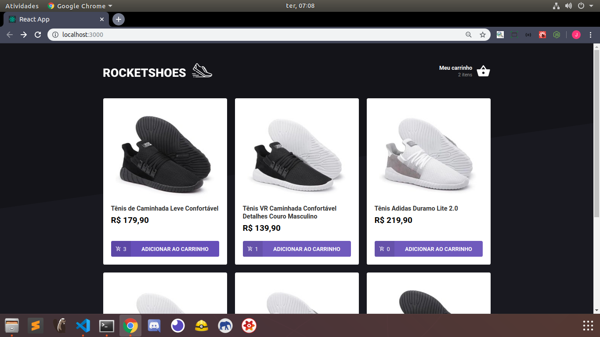
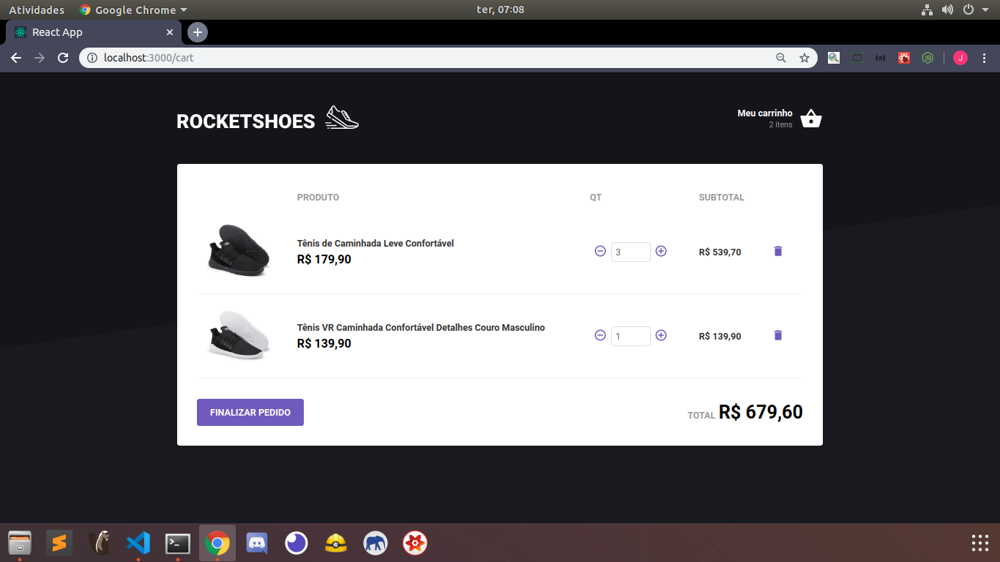

<h1>E-commerce project built with React-Redux and Redux-Saga</h1>
<h2>RocketShoes</h2>

  
  

<ul>
<h3>Dependencies:</h3>
  <li>Redux to implement flux architecture</li>
  <li>Redux-Saga to intercept actions with middlewares</li>
  <li>React-toastify to create error animations </li>
  <li>Axios to consume an api</li>
  <li>React Icons to get famous icons packages</li>
  <li>React Icons to get famous icons packages</li>
</ul>
